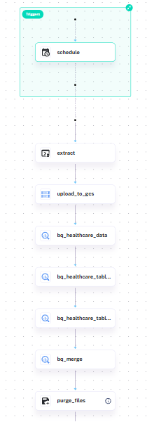
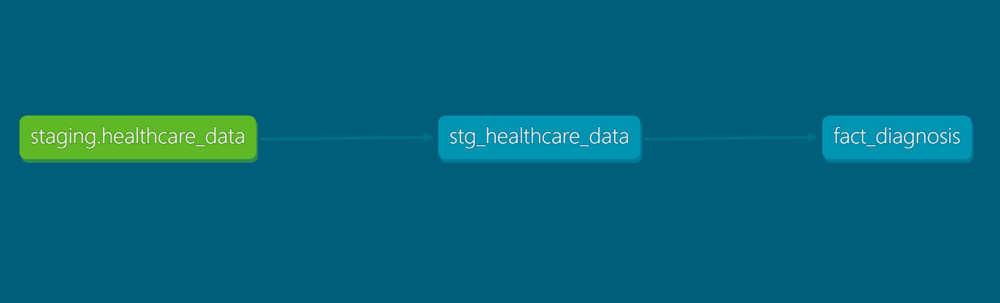
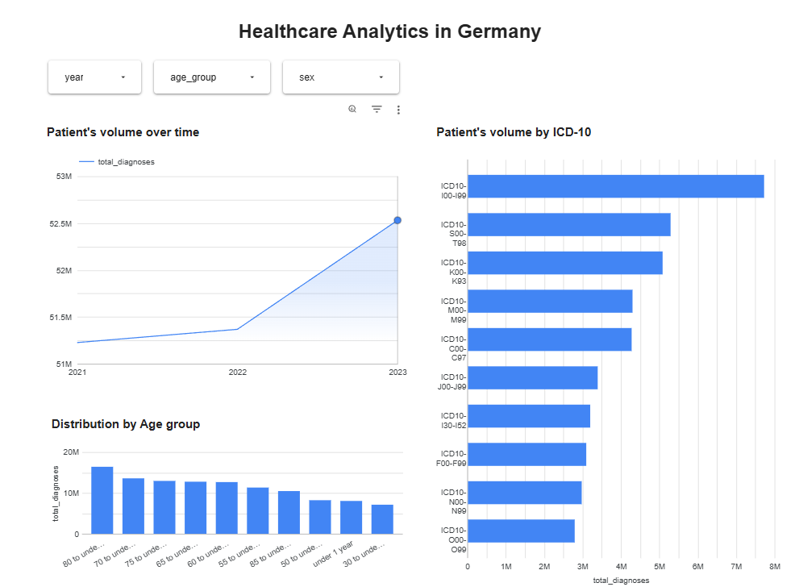

# Healthcare Data Engineering Project

This project focuses on analyzing healthcare data in Germany from 2021 to 2023 based on ICD-10 codes. The data is sourced from [GENESIS-Online](https://www-genesis.destatis.de), a platform provided by the Federal Statistical Office of Germany. The analysis aims to provide insights into hospital in-patient diagnoses categorized by ICD-10 codes, year, sex, and age group.

## Project Objectives

- **Data Ingestion**: Automate the process of downloading and storing healthcare data.
- **Data Transformation**: Clean, transform, and stage the data for analytics.
- **Data Analysis**: Build analytical models to extract insights from the data.
- **Visualization**: Enable visualization of healthcare trends using dashboards.

## Process Flow

1. **Data Ingestion**:
   - **Tool**: Kestra
   - **Process**: Automates the download of healthcare data from GENESIS-Online and uploads it to Google Cloud Storage (GCS).

### Flow Description and Topology

| Step | Task                     | Behavior                              |
|------|--------------------------|---------------------------------------|
| 1    | extract + upload_to_gcs  | Download & upload raw CSV            |
| 2    | bq_healthcare_data       | Ensure final table structure          |
| 3    | bq_healthcare_table_ext  | External table with explicit schema   |
| 4    | bq_healthcare_table_tmp  | Rename "bad" columns to proper names  |
| 5    | bq_merge                 | Merge into final dataset              |
| 6    | purge_files              | Clean temporary files                 |

    

The image above illustrates the Kestra workflow topology, showcasing the automated steps involved in the data ingestion process. Each step is designed to ensure seamless data flow from raw extraction to final dataset preparation.

2. **Infrastructure Setup**:
   - **Tool**: Terraform
   - **Process**: Provisions cloud resources such as GCS buckets and BigQuery datasets.

3. **Data Transformation**:
   - **Tool**: DBT (Data Build Tool)
   - **Process**: Cleans, transforms, and models the raw data into analytics-ready tables in BigQuery.

### Data Lineage Graph

As part of the **Data Transformation** process, the following lineage graph illustrates the flow of data from raw ingestion to analytics-ready tables:

    

    

4. **Data Analysis**:
   - **Tool**: BigQuery
   - **Process**: Executes SQL queries to analyze the transformed data.

5. **Visualization**:
   - **Tool**: Google Looker
   - **Process**: Creates interactive dashboards to visualize healthcare trends.

## Folder Structure

├── .gitignore ├── README.md ├── get_data_schema.ipynb ├── 01_terraform/ │ ├── main.tf │ ├── variables.tf ├── 02_workflow_orchestration/ │ ├── 01_kv.yaml │ ├── 02_gc_flow.yaml │ ├── docker-compose.yml ├── 03_analytics_engineering/ │ ├── .gitignore │ ├── dbt_project.yml │ ├── README.md │ ├── analyses/ │ │ └── .gitkeep │ ├── macros/ │ │ └── .gitkeep │ ├── models/ │ │ ├── core/ │ │ │ └── schema.yml │ │ ├── staging/ │ │ ├── schema.yml │ │ └── stg_healthcare_data.sql │ ├── seeds/ │ ├── snapshots/ │ ├── tests/ ├── data/ │ ├── 23131-0002_en_2021.csv │ ├── 23131-0002_en_2022.csv │ ├── 23131-0002_en_2023.csv 

### Folder Descriptions

#### `01_terraform/`
Contains Terraform scripts for provisioning cloud infrastructure. This includes defining resources for storage, compute, and other services required for the project.

#### `02_workflow_orchestration/`
Holds configuration files for workflow orchestration using tools like Kestra. It automates tasks such as downloading data, uploading it to Google Cloud Storage (GCS), and running BigQuery queries.

- **`02_gc_flow.yaml`**: Defines the workflow for downloading data, uploading it to GCS, and creating BigQuery tables.

#### `03_analytics_engineering/`
This folder contains the DBT (Data Build Tool) project for transforming and modeling the data.

- **`models/core/`**: Contains the final fact tables used for analysis.
- **`models/staging/`**: Includes staging models that clean and prepare raw data for downstream analysis.
- **`dbt_project.yml`**: Configuration file for the DBT project.

#### `data/`
Contains raw CSV files with healthcare data for the years 2021, 2022, and 2023.

#### `get_data_schema.ipynb`
A Jupyter Notebook used for exploring the schema of the raw data and mapping it to BigQuery-compatible SQL types.

## Data Overview

The dataset includes hospital in-patient diagnoses categorized by ICD-10 codes. Key fields include:

- **Year**: Year of diagnosis.
- **Sex**: Gender of the patient.
- **Age Group**: Age group of the patient.
- **ICD-10 Code**: Diagnosis code based on the ICD-10 classification.
- **Diagnosis Count**: Number of diagnoses recorded.

## How to Run the Project

1. **Infrastructure Setup**:
   - Navigate to the `01_terraform/` folder.
   - Run `terraform init` and `terraform apply` to provision the required cloud resources.

2. **Workflow Orchestration**:
   - Navigate to the `02_workflow_orchestration/` folder.
   - Use the defined YAML files to execute workflows for data ingestion and transformation.

3. **Data Transformation**:
   - Navigate to the `03_analytics_engineering/` folder.
   - Run `dbt build` to execute the transformation models.

4. **Data Exploration**:
   - Use the `get_data_schema.ipynb` notebook to explore and validate the data schema.

5. **Visualization**:
   - Access the Google Looker dashboard to explore interactive visualizations of healthcare trends.

## Key Features

- **Automated Data Pipeline**: Fully automated workflows for data ingestion and transformation.
- **Cloud-Native Architecture**: Utilizes Google Cloud Platform (GCP) services like GCS and BigQuery.
- **Scalable Analytics**: DBT models enable scalable and reusable data transformations.
- **ICD-10 Analysis**: Provides insights into healthcare trends based on ICD-10 codes.

## Visualization Dashboard

The project includes an interactive dashboard built using **Google Looker**. The dashboard provides visual insights into healthcare trends, such as:

- Diagnosis trends over time.
- Age group distributions.
- ICD-10 code-specific analysis.

## Dashboard Preview

Below is a preview of the interactive dashboard:

    

Access the dashboard [here]https://lookerstudio.google.com/reporting/554487eb-9667-4d0d-9e56-764cbd0e05df