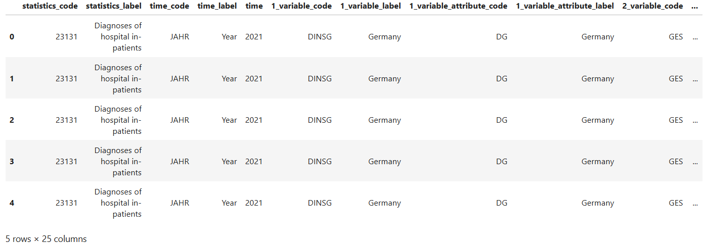
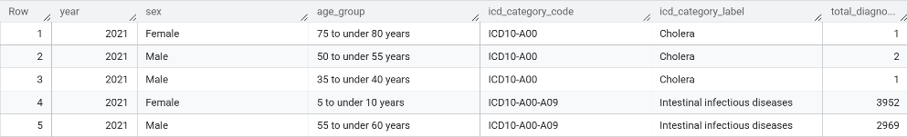

# ☁️ Healthcare Data Engineering Project


> A cloud-integrated data engineering project analyzing German healthcare diagnosis data using ICD-10 codes (2021–2023). Built using GCP, DBT, Kestra, Terraform, and Looker Studio.

---

## 📑 Table of Contents

- [About](#about)
- [Prerequisites](#-prerequisites)
- [Objectives](#objectives)
- [Workflow Overview](#workflow-overview)
- [Folder Structure](#-folder-structure)
- [Folder Descriptions](#-folder-descriptions)
- [Final Data Overview](#-final-data-overview)
- [Data Model Screenshots](#-data-model-screenshots)
- [How to Run](#-how-to-run)
- [Visualization Dashboard](#visualization-dashboard)
- [Key Features](#-key-features)

---


## 📘 About

This is a **cloud-integrated data engineering project** designed to explore end-to-end data workflows. It is based on the principles and tools taught in the excellent [Data Engineering Zoomcamp](https://github.com/DataTalksClub/data-engineering-zoomcamp) by DataTalks.Club.

The project analyzes publicly available healthcare data, specifically ICD-10 diagnosis statistics broken down by age group, gender, and year. The scope includes hospital data from Germany for the years 2021–2023. 

The data source is [GENESIS-Online](https://www-genesis.destatis.de), a platform maintained by the Federal Statistical Office of Germany.

> 🔧 **Note**: The primary focus of this project is not on healthcare insights, but on applying data engineering technologies to build a scalable, end-to-end production-grade data pipeline.


---

## 🛠 Prerequisites

Install the following tools locally before running the project:

- [Terraform](https://developer.hashicorp.com/terraform/downloads)
- [Google Cloud CLI](https://cloud.google.com/sdk/docs/install)
- [Kestra](https://kestra.io/docs) (Docker setup)
- [DBT CLI](https://docs.getdbt.com/docs/dbt-cli/installation)
- Python 3.8+
- Jupyter (optional, for schema exploration)

---

## 🎯 Objectives

- **Data Ingestion**: Automate the process of downloading and storing healthcare data from GENESIS-Online (csv Format) to GCS with Kestra.
- **Data Transformation**: Clean, transform, and stage the data for Analytics in BigQuery using DBT.
- **Data Analysis**: Build analytical models to extract insights from the data.
- **Data Visualization**: Enable visualization of healthcare trends with Looker Studio dashboard.

---

## 🔁 Workflow Overview

### 1. **Data Ingestion** (Kestra)

<p align="center">
  
</p>

The image above illustrates the Kestra workflow topology, showcasing the automated steps involved in the data ingestion process. Each step is designed to ensure seamless data flow from raw extraction to final dataset preparation.


| Step | Task                     | Description                            |
|------|--------------------------|----------------------------------------|
| 1    | `extract + upload_to_gcs` | Download and store raw CSV             |
| 2    | `bq_healthcare_data`      | Create final table structure           |
| 3    | `bq_healthcare_table_ext` | External table with defined schema     |
| 4    | `bq_healthcare_table_tmp` | Rename "bad" column names              |
| 5    | `bq_merge`                | Merge into curated dataset             |
| 6    | `purge_files`             | Clean up temporary files               |


### 2. **Infrastructure** (Terraform)

Provisions GCS buckets and BigQuery datasets on Google Cloud.


### 3. **Transformation** (DBT)

DBT (Data Build Tool) cleans, transforms, and models the raw data into analytics-ready tables in BigQuery:
- Staging raw tables
- Creating fact tables (under "core")

As part of the this process, the following lineage graph illustrates the flow of data from raw ingestion to analytics-ready tables:

<p align="center">
  
</p>


### 4. **Analysis** (BigQuery)

- SQL queries for aggregations, trends, and cohort analyses.

### 5. **Visualization** (Looker Studio)

- Custom dashboard to visualize healthcare trends.

---

## 🗂 Folder Structure

```
├── 01_terraform/                  # GCP infrastructure setup
├── 02_workflow_orchestration/    # Kestra workflows
├── 03_analytics_engineering/     # DBT models and configs
├── data/                          # Raw input CSVs
├── get_data_schema.ipynb         # Notebook for schema exploration
├── README.md
```

---

## 🗂 Folder Descriptions

#### `01_terraform/`
Contains Terraform scripts for provisioning cloud infrastructure. This includes defining resources for storage, compute, and other services required for the project.

#### `02_workflow_orchestration/`
Holds configuration files for workflow orchestration using tools like Kestra. It automates tasks such as downloading data, uploading it to Google Cloud Storage (GCS), and running BigQuery queries.

- **`02_gc_flow.yaml`**: Defines the workflow for downloading data, uploading it to GCS, and creating BigQuery tables.

#### `03_analytics_engineering/`
This folder contains the DBT (Data Build Tool) project for transforming and modeling the data.

- **`models/core/`**: Contains the final fact tables used for analysis.
- **`models/staging/`**: Includes staging models that clean and prepare raw data for downstream analysis.
- **`dbt_project.yml`**: Configuration file for the DBT project.

#### `data/`
Contains raw CSV files with healthcare data for the years 2021, 2022, and 2023.

#### `get_data_schema.ipynb`
A Jupyter Notebook used for exploring the schema of the raw data and mapping it to BigQuery-compatible SQL types.

---

## 🧾 Final Data Overview

The dataset includes hospital in-patient diagnoses categorized by ICD-10 codes.

| Field         | Description                      |
|---------------|----------------------------------|
| Year          | Year of diagnosis                |
| Sex           | Patient gender                   |
| Age Group     | Patient age group              |
| ICD-10 Code   | International diagnosis code     |
| Diagnosis Count | Total diagnosis occurrences   |

---

## 📸 Data Model Screenshots

- Raw Data Preview 
 
<p align="center">
  
</p>

- Final Table Model  

<p align="center">
  
</p>

---

## 🚀 How to Run

```bash
# 1. Setup infrastructure
cd 01_terraform
terraform init
terraform apply

# 2. Run Kestra ingestion workflow
cd 02_workflow_orchestration
# (Use Docker-compose or Kestra Cloud instance)

# 3. Transform data with DBT
cd 03_analytics_engineering
dbt build
```

---

## 📊 Visualization Dashboard

The project includes an interactive dashboard built using **Google Looker**. The dashboard provides visual insights into healthcare trends, such as:

- Diagnosis trends over time.
- Age group distributions.
- ICD-10 code-specific analysis.

<p align="center">
  
</p>

🔗 [View Live Dashboard](https://lookerstudio.google.com/reporting/554487eb-9667-4d0d-9e56-764cbd0e05df)

---

## 🚀 Key Features

- **Automated Data Pipeline**: Fully automated workflows for data ingestion and transformation.
- **Cloud-Native Architecture**: Utilizes Google Cloud Platform (GCP) services like GCS and BigQuery.
- **Scalable Analytics**: DBT models enable scalable and reusable data transformations.
- **ICD-10 Analysis**: Provides insights into healthcare trends based on ICD-10 codes.
